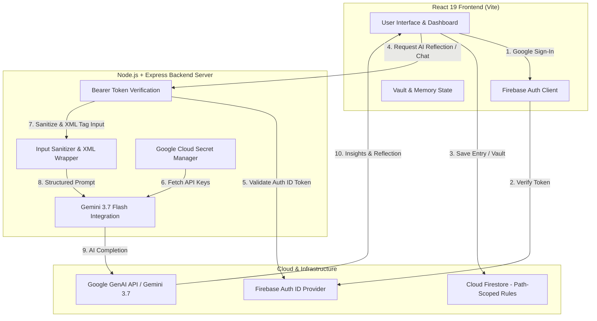

# 📔 Personal Gemini Journal

<p align="center">
  <b>A production-grade, privacy-first AI journaling web application built with Google Gemini 3.7 Flash, React 19, Express, Firebase Authentication, and Cloud Firestore.</b>
</p>

<p align="center">
  
  
  
  
  
  
  
  
</p>

---

## 📑 Table of Contents

- [Overview](#-overview)
- [Key Features](#-key-features)
- [System Architecture & Data Flow](#-system-architecture--data-flow)
- [Security & Privacy Model](#-security--privacy-model)
- [Tech Stack](#-tech-stack)
- [Project Structure](#-project-structure)
- [Getting Started](#-getting-started)
  - [Prerequisites](#prerequisites)
  - [Environment Setup](#environment-setup)
  - [Local Development](#local-development)
  - [Production Build](#production-build)
- [API Reference](#-api-reference)
- [Google Cloud Run Deployment](#-google-cloud-run-deployment)
- [Security Command Center](#-security-command-center)
- [License](#-license)

---

## 🌟 Overview

**Personal Gemini Journal** is an enterprise-ready, privacy-focused digital journal designed to combine deep emotional reflection with cutting-edge generative AI capabilities. Powered by **Google Gemini 3.7 Flash**, the platform offers automated entry analysis, empathetic conversational guidance, explicit AI memory management, and an isolated, re-authenticated **Privacy Vault** for sensitive personal thoughts.

The system is built on a zero-trust model: **zero client-side API keys**, path-scoped Firestore database security rules, prompt injection defense, and optional secret loading via **Google Cloud Secret Manager**.

---

## ✨ Key Features

### 🖋️ Write → Save → Reflect Workflow
- **Rich Journaling Interface**: Capture thoughts with multi-mood selection (9 distinct emotional states) and customizable tag categories.
- **Automated AI Reflections**: Server-side Gemini 3.7 Flash processing provides emotional tone evaluation, cognitive insights, key themes, constructive reflection prompts, and tag suggestions.

### 💬 Empathetic AI Companion
- **Interactive Dialogue**: Engage in meaningful follow-up conversations grounded in your journal history.
- **Context Bounding**: Strict token limits and XML instruction delimitation ensure focused, safe responses without prompt drift or hallucination.

### 🧠 Explicit AI Memory Management
- **User-Controlled Retention**: AI memories are never saved automatically. Key insights extracted during chat sessions require explicit user approval before persisting to Firestore.
- **Full Erasure Control**: Instantly review and delete individual memory items or clear all companion memory at any time.

### 🔒 Protected Privacy Vault
- **Zero AI Model Exposure**: Vault entries are 100% excluded from all Gemini prompts, reflection context, and model inputs.
- **Elevated Re-Authentication**: Accessing the vault requires fresh Google re-authentication (`reauthenticateWithPopup`), preventing unauthorized access on shared or unlocked devices.
- **Zero Local Caching**: Vault contents are fetched strictly on-demand and purged from client memory upon lock.

### 🛡️ Real-Time Security Command Center
- **Automated Diagnostic Suite**: 12 active security rules continuously audit Firestore scope isolation, secret management, prompt injection boundaries, and input sanitization.
- **Interactive Security Score**: Live security score metric with real-time policy evaluation, threat matrix, and diagnostic breakdown.

---

## 🏗️ System Architecture & Data Flow



---

## 🔒 Security & Privacy Model

The application enforces a multi-layered security architecture designed for user privacy and compliance:

| Security Vector | Implementation Detail | Guarantee |
| :--- | :--- | :--- |
| **API Secret Isolation** | Gemini API keys are consumed exclusively by the server via `process.env` or Google Cloud Secret Manager. | Zero client-side API key exposure. |
| **Data Scope Isolation** | Firestore security rules enforce path isolation (`/users/{uid}/*`). | Users cannot read or write another user's data. |
| **Privacy Vault** | Re-authentication required (`reauthenticateWithPopup`). Excluded from AI prompts. | Zero AI context leakage; resistant to physical device access. |
| **Prompt Injection Guard** | User entries are wrapped in `<untrusted_journal_entry>` XML blocks with strict delimitations. | Prevents adversarial prompt hijacking. |
| **Input Sanitization** | Express middleware enforces payload size limits and string truncation. | Prevents buffer overload and DOS vectors. |

---

## 🛠️ Tech Stack

### Frontend Architecture
- **Framework**: React 19, TypeScript
- **Build Tool**: Vite 6
- **Styling**: Tailwind CSS v4, Lucide React (Icons), Motion (Animations)

### Backend Architecture
- **Runtime**: Node.js 18+ / Express 4
- **Bundler**: esbuild & tsx
- **AI SDK**: `@google/genai` (Google GenAI SDK)
- **Secrets**: `@google-cloud/secret-manager`

### Database & Authentication
- **Authentication**: Firebase Authentication (Google Sign-In Provider)
- **Database**: Google Cloud Firestore (Document Database)

---

## 📁 Project Structure

```
personal-gemini-journal-2/
├── api/                    # Express API router & endpoints
├── assets/                 # Static visual assets & diagrams
├── src/                    # React 19 Frontend application
│   ├── components/         # Modular UI components
│   │   ├── CompanionModal.tsx
│   │   ├── DiagnosticsModal.tsx
│   │   ├── EntryCard.tsx
│   │   ├── MemoryModal.tsx
│   │   ├── Navigation.tsx
│   │   ├── SecurityCommandCenter.tsx
│   │   └── VaultModal.tsx
│   ├── context/            # React Context (Auth, Journal, Theme)
│   ├── firebase.ts         # Client Firebase initialization
│   ├── types.ts            # TypeScript interfaces & types
│   ├── App.tsx             # Main dashboard layout
│   └── main.tsx            # Application entrypoint
├── server.ts               # Express server & Gemini GenAI API service
├── firestore.rules         # Security & access control rules
├── firebase-blueprint.json # Database schema specification
├── Dockerfile              # Production multi-stage Docker build
├── vite.config.ts          # Vite configuration
├── tsconfig.json           # TypeScript configuration
└── README.md               # Project documentation
```

---

## 🚀 Getting Started

### Prerequisites

- **Node.js**: v18.0.0 or higher
- **Package Manager**: `npm` (v9+) or `bun`
- **Firebase Account**: Cloud Firestore & Google Authentication enabled
- **Google Gemini API Key**: Obtain from [Google AI Studio](https://aistudio.google.com/)

### Environment Setup

1. **Clone the Repository**
   ```bash
   git clone https://github.com/Yugp12/personal-gemini-journal-2.git
   cd personal-gemini-journal-2
   ```

2. **Install Dependencies**
   ```bash
   npm install
   ```

3. **Configure Environment Variables**
   Create a `.env` file in the project root:
   ```bash
   cp .env.example .env
   ```

   Fill in your API credentials:
   ```env
   # Server Configuration
   PORT=8080
   APP_URL=https://personal-gemini-journal-2.vercel.app
   NODE_ENV=production

   # Gemini Model & Secret Manager (Server-Side)
   GEMINI_MODEL=gemini-3.7-flash
   GEMINI_SECRET_NAME=GEMINI_API_KEY
   GEMINI_SECRET_VERSION=latest
   GOOGLE_CLOUD_PROJECT=your-gcp-project-id
   GEMINI_API_KEY=your_gemini_api_key_here

   # Client Firebase Credentials (Vite)
   VITE_FIREBASE_API_KEY=your_firebase_api_key
   VITE_FIREBASE_AUTH_DOMAIN=your_project.firebaseapp.com
   VITE_FIREBASE_PROJECT_ID=your_project_id
   VITE_FIREBASE_STORAGE_BUCKET=your_project.appspot.com
   VITE_FIREBASE_MESSAGING_SENDER_ID=your_sender_id
   VITE_FIREBASE_APP_ID=your_app_id
   ```

### Local Development

Launch the combined Express backend and Vite frontend development server:

```bash
npm run dev
```

The application will be accessible at: `http://localhost:3000`

### Production Build

Compile the TypeScript frontend and bundle the server using `esbuild`:

```bash
npm run build
```

Start the production server:

```bash
npm start
```

---

## 📡 API Reference

The backend Express server exposes the following RESTful endpoints:

| Method | Endpoint | Authorization | Description |
| :--- | :--- | :--- | :--- |
| `GET` | `/health` | Public | Returns service uptime and operational status. |
| `POST` | `/api/reflect` | Bearer Firebase ID Token | Analyzes a journal entry using Gemini 3.7 Flash and returns structured reflections. |
| `POST` | `/api/chat` | Bearer Firebase ID Token | Multi-turn conversational chat grounded in approved user memories. |
| `POST` | `/api/extract-memories` | Bearer Firebase ID Token | Extracts suggested long-term memory points from companion interactions. |

---

## ☁️ Google Cloud Run Deployment

The repository includes a production-optimized multi-stage `Dockerfile` configured for Google Cloud Run.

### Containerization Overview
- **Multi-Stage Build**: Separates TypeScript compilation from Node runtime to minimize final container image size.
- **Port Binding**: Listens dynamically on `process.env.PORT` (defaults to `8080`).
- **Health Verification**: Built-in health check endpoints (`/health` & `/api/health`).

### Deployment Command

```bash
gcloud run deploy personal-gemini-journal-2 \
  --source . \
  --region asia-southeast1 \
  --allow-unauthenticated \
  --port 8080 \
  --set-env-vars NODE_ENV=production
```

---

## 🛡️ Security Command Center

Access the **Security Command Center** directly within the application navbar to inspect real-time system integrity:

- **Path Scoping Audit**: Asserts Firestore document access is strictly bounded by `/users/{uid}/`.
- **Vault Context Isolation**: Confirms vault entries are isolated from Gemini AI context.
- **Secret Manager Auditing**: Verifies secrets are retrieved dynamically without hardcoded fallback.

---

## 📄 License

Distributed under the **MIT License**. See `LICENSE` for more information.

<p align="center">
  Crafted with ❤️ using <b>Google Gemini 3.7 Flash</b> & <b>React 18/19</b>
</p>
